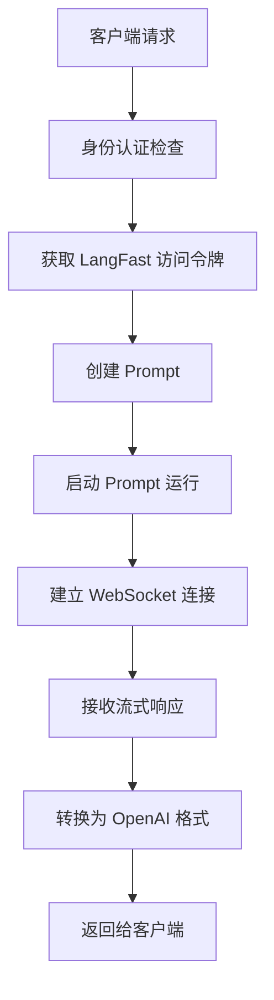

# LangFast to OpenAI API Proxy

一个高性能的 Deno 服务器，将 LangFast 服务转换为完全兼容 OpenAI API 格式的代理服务，支持流式和非流式响应。

## 🌟 核心特性

- **🔄 完全兼容 OpenAI API** - 支持标准的 `/v1/models` 和 `/v1/chat/completions` 端点
- **⚡ 流式响应** - 通过 Server-Sent Events (SSE) 实时返回增量聊天内容
- **📦 非流式响应** - 等待完整响应后一次性返回 JSON 格式的最终结果
- **🔐 可选身份认证** - 支持 Bearer Token 认证保护 API 端点
- **🚀 零依赖部署** - 使用 Deno 原生 WebSocket 实现 Socket.IO 协议
- **📊 丰富模型支持** - 支持 GPT-4.1、GPT-5、O1、O3、O4 等最新模型

## 🚀 快速开始

### 前置要求

- 安装 [Deno](https://deno.land/) (版本 1.40+)

### 本地运行

```bash
# 克隆仓库
git clone https://github.com/CassiopeiaCode/langfast2api.git
cd langfast2api

# 启动开发服务器
deno task dev
```

服务器将在 `http://localhost:8000` 上启动。

### 启用身份认证（可选）

如需启用 API 身份认证，设置环境变量 `USER_SET_KEY`：

```bash
# Linux/macOS
export USER_SET_KEY="your-secret-key"
deno task dev

# Windows (PowerShell)
$env:USER_SET_KEY="your-secret-key"
deno task dev
```

启用后，所有 `/v1/chat/completions` 请求需要在 Header 中携带：
```
Authorization: Bearer your-secret-key
```

## 📚 API 使用指南

### 获取可用模型列表

```bash
curl http://localhost:8000/v1/models
```

**响应示例：**
```json
{
  "object": "list",
  "data": [
    {
      "id": "gpt-5",
      "object": "model",
      "created": 1723077125,
      "owned_by": "openai"
    }
  ]
}
```

### 非流式聊天完成

```bash
curl -X POST http://localhost:8000/v1/chat/completions \
  -H "Content-Type: application/json" \
  -d '{
    "model": "gpt-5",
    "messages": [
      {"role": "system", "content": "You are a helpful assistant."},
      {"role": "user", "content": "Hello!"}
    ],
    "stream": false
  }'
```

### 流式聊天完成

```bash
curl -N -X POST http://localhost:8000/v1/chat/completions \
  -H "Content-Type: application/json" \
  -d '{
    "model": "gpt-5",
    "messages": [
      {"role": "system", "content": "You are a helpful assistant."},
      {"role": "user", "content": "写一首关于秋天的诗"}
    ],
    "stream": true
  }'
```

### 带身份认证的请求

如果启用了 `USER_SET_KEY` 环境变量：

```bash
curl -X POST http://localhost:8000/v1/chat/completions \
  -H "Content-Type: application/json" \
  -H "Authorization: Bearer your-secret-key" \
  -d '{
    "model": "gpt-5",
    "messages": [
      {"role": "user", "content": "Hello!"}
    ],
    "stream": false
  }'
```

## 🏗️ 技术架构

### 核心组件

- **[`main.ts`](main.ts)**: 主服务器文件，处理 HTTP 路由和请求分发
- **[`langfast_client.ts`](langfast_client.ts)**: 封装与 LangFast Supabase 后端通信的核心逻辑
- **[`types.ts`](types.ts)**: TypeScript 类型定义
- **[`models.json`](models.json)**: 支持的模型列表配置
- **[`deploy.ts`](deploy.ts)**: Deno Deploy 部署入口点

### 工作流程



### 关键技术实现

1. **身份认证层**: 可选的 Bearer Token 验证
2. **令牌管理**: 自动获取和管理 LangFast 访问令牌
3. **WebSocket 通信**: 原生 WebSocket 实现 Socket.IO 协议
4. **流式处理**: 实时转换和转发响应数据
5. **错误处理**: 完善的错误捕获和响应机制

## 🌐 部署指南

### Deno Deploy 部署

本项目专为 Deno Deploy 优化，支持一键部署。

#### 方法一：通过控制台手动部署

1. **Fork GitHub 仓库**
   - 访问 [CassiopeiaCode/langfast2api](https://github.com/CassiopeiaCode/langfast2api)
   - 点击右上角的 "Fork" 按钮
   - 选择你的 GitHub 账户作为目标

2. **创建 Deno Deploy 项目**
   - 访问 [Deno Deploy Dashboard](https://dash.deno.com/)
   - 点击 "New Project"
   - 选择 "GitHub" 连接你的 GitHub 账户
   - 选择你 fork 的仓库（格式为 `你的用户名/langfast2api`）
   - 选择 `main` 分支

3. **配置部署设置**
   - **入口点**: 选择 `deploy.ts`
   - **环境变量**（可选）: 
     - 如需启用身份认证，添加 `USER_SET_KEY` 环境变量
   - 点击 "Deploy" 开始部署

4. **获取部署 URL**
   - 部署完成后，你会得到一个类似 `https://langfast2api-xxxx.deno.dev` 的 URL
   - 这个 URL 就是你的 API 端点

#### 方法二：通过 GitHub Actions 自动部署

1. **获取 Deno Deploy 访问令牌**
   - 在 Deno Deploy Dashboard 中
   - 点击右上角头像 → "Account"
   - 在 "Deno Deploy API tokens" 部分创建新令牌

2. **配置 GitHub Secrets**
   - 在你 fork 的 GitHub 仓库中
   - 进入 "Settings" → "Secrets and variables" → "Actions"
   - 添加以下 secrets：
     - `DENO_DEPLOY_TOKEN`: Deno Deploy 令牌
     - `DENO_PROJECT_ID`: 你的 Deno Deploy 项目 ID

3. **触发部署**
   - 推送代码到 `main` 分支会自动触发部署
   - 也可以在 GitHub Actions 页面手动触发

### 部署后测试

```bash
# 替换 YOUR_DEPLOY_URL 为你的实际部署 URL
YOUR_DEPLOY_URL="https://your-project-name.deno.dev"

# 测试健康检查
curl $YOUR_DEPLOY_URL/

# 测试模型列表
curl $YOUR_DEPLOY_URL/v1/models

# 测试聊天完成
curl -X POST $YOUR_DEPLOY_URL/v1/chat/completions \
  -H "Content-Type: application/json" \
  -d '{
    "model": "gpt-5",
    "messages": [{"role": "user", "content": "Hello!"}],
    "stream": false
  }'
```

## 🔧 开发指南

### 本地开发

```bash
# 开发模式（自动重启）
deno task dev

# 代码格式化
deno fmt

# 代码检查
deno lint

# 类型检查
deno check
```

### 项目结构

```
langfast2api/
├── main.ts              # 主服务器文件
├── langfast_client.ts   # LangFast 客户端
├── types.ts             # 类型定义
├── models.json          # 模型配置
├── deploy.ts            # 部署入口
├── deno.jsonc           # Deno 配置
└── README.md            # 项目文档
```

### 环境变量

| 变量名 | 描述 | 必需 | 默认值 |
|--------|------|------|--------|
| `USER_SET_KEY` | API 认证密钥 | 否 | 无 |

## 🚨 故障排除

### 常见问题

**Q: 部署后返回 404 错误**
A: 检查部署入口点是否设置为 `deploy.ts`，确保选择了正确的分支。

**Q: WebSocket 连接失败**
A: Deno Deploy 对 WebSocket 连接有时间限制，长时间请求可能需要优化。

**Q: 认证失败**
A: 检查 `USER_SET_KEY` 环境变量是否正确设置，请求头格式是否为 `Bearer your-secret-key`。

**Q: 模型列表为空**
A: 检查 `models.json` 文件是否存在且格式正确。

### 调试模式

在本地开发时，可以通过以下方式启用详细日志：

```bash
# 启用详细日志
RUST_LOG=debug deno task dev
```

## 📝 更新日志

### v1.0.0
- 初始版本发布
- 支持基本的 OpenAI API 兼容性
- 实现流式和非流式响应
- 添加身份认证支持

## 🤝 贡献指南

欢迎提交 Issue 和 Pull Request！

1. Fork 本仓库
2. 创建特性分支 (`git checkout -b feature/AmazingFeature`)
3. 提交更改 (`git commit -m 'Add some AmazingFeature'`)
4. 推送到分支 (`git push origin feature/AmazingFeature`)
5. 开启 Pull Request

## 📄 许可证

本项目采用 MIT 许可证 - 查看 [LICENSE](LICENSE) 文件了解详情。

## 🔗 相关链接

- [LangFast 官方文档](https://langfast.ai)
- [OpenAI API 文档](https://platform.openai.com/docs/api-reference)
- [Deno Deploy 文档](https://deno.com/deploy)

---

⭐ 如果这个项目对你有帮助，请给它一个星标！